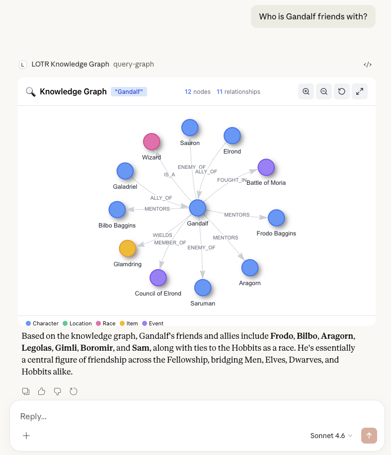

# LOTR Knowledge Graph

An interactive Lord of the Rings knowledge graph visualization built with [Skybridge](https://docs.skybridge.tech) and Neo4j. Explore the world of Middle-earth through an interactive graph of characters, locations, items, and events — all rendered inside Claude.



## Features

- **Full Graph Visualization** — View the entire LOTR universe with 56 nodes and 70+ relationships
- **Interactive Exploration** — Click nodes to see character details, relationships, and properties
- **Query-Based Filtering** — Search by character name, node type, or relationship type
- **Real-time Rendering** — Powered by vis-network for smooth, physics-based graph layouts

### What's in the Graph?

| Category   | Count | Examples                                         |
| ---------- | ----- | ------------------------------------------------ |
| Characters | 24    | Frodo, Gandalf, Aragorn, Legolas, Gollum, Sauron |
| Locations  | 12    | The Shire, Rivendell, Mordor, Minas Tirith       |
| Races      | 7     | Hobbit, Elf, Dwarf, Human, Wizard, Orc, Ent      |
| Items      | 7     | The One Ring, Sting, Andúril, Mithril Coat       |
| Events     | 6     | Council of Elrond, Battle of Helm's Deep         |

### Relationships

Family ties, friendships, alliances, enemies, romance, mentorship, item ownership, battle participation, and more.

## Prerequisites

### Node.js (v24.9+)

- macOS: `brew install node`
- Linux / other: [nodejs.org/en/download](https://nodejs.org/en/download)

### pnpm

```bash
npm install -g pnpm
```

### Docker (for Neo4j)

- macOS: `brew install --cask docker`
- Linux / other: [docs.docker.com/get-docker](https://docs.docker.com/get-docker/)

### Task Runner (optional, for convenience commands)

- macOS: `brew install go-task`
- Linux / other: [taskfile.dev/installation](https://taskfile.dev/installation/)

### Clerk Project

Create a project at [clerk.com/dashboard](https://clerk.com/dashboard). You'll need:

- **Secret Key** (`CLERK_SECRET_KEY`)
- **Publishable Key** (`CLERK_PUBLISHABLE_KEY`)

Enable Dynamic Client Registration (DCR):

1. Go to **Configure** > **Developers** > **OAuth applications** > **Settings**
2. Toggle on **Dynamic client registration**

## Quick Start

**1. Install dependencies**

```bash
pnpm i
```

**2. Configure environment variables**

```bash
cp .env.example .env
```

Fill in your Clerk keys:

```
CLERK_SECRET_KEY=sk_test_xxxxx
CLERK_PUBLISHABLE_KEY=pk_test_xxxxx
```

**3. Start Neo4j and seed the database**

```bash
# Using Task runner (recommended)
task neo4j   # Start Neo4j container
task seed    # Load LOTR data

# Or manually
docker-compose up -d
cat scripts/seed.cypher | docker exec -i neo4j cypher-shell -u neo4j -p password123
```

**4. Start the dev server**

```bash
pnpm dev
# Or: task dev
```

**5. Open DevTools**

Visit [http://localhost:3000](http://localhost:3000) to test locally.

## Connecting to Claude

Tunnel your local server with [cloudflared](https://developers.cloudflare.com/cloudflare-one/connections/connect-networks/downloads/):

```bash
cloudflared tunnel --url http://localhost:3000
# Or: task tunnel
```

Add your tunnel URL with `/mcp` appended (e.g. `https://xxx.trycloudflare.com/mcp`) as a remote MCP server in Claude settings.

### Example Prompts

Once connected, try asking Claude:

- "Show me the knowledge graph"
- "Query the graph for Gandalf and his connections"
- "Show me all the hobbits in the Fellowship"
- "What items does Frodo carry?"

## Task Commands

```bash
task neo4j    # Start Neo4j database
task seed     # Load LOTR seed data
task dev      # Start dev server
task tunnel   # Start Cloudflare tunnel
task start    # Start both Neo4j and dev server
```

## Project Structure

```
├── server/src/
│   ├── server.ts      # MCP widget registrations
│   ├── neo4j.ts       # Neo4j queries and connection
│   └── env.ts         # Environment configuration
├── web/src/widgets/
│   ├── knowledge-graph.tsx  # Full graph visualization
│   └── query-graph.tsx      # Filtered graph queries
├── scripts/
│   └── seed.cypher    # LOTR knowledge graph data
└── docker-compose.yml # Neo4j container config
```

## Tech Stack

- **[Skybridge](https://docs.skybridge.tech/)** — MCP framework for building Claude apps
- **[Neo4j](https://neo4j.com/)** — Graph database
- **[vis-network](https://visjs.github.io/vis-network/docs/network/)** — Graph visualization
- **[Clerk](https://clerk.com/)** — OAuth authentication

## Deploy to Production

Use [Alpic](https://alpic.ai/) to deploy:

[](https://app.alpic.ai/new/clone?repositoryUrl=https%3A%2F%2Fgithub.com%2Falpic-ai%2Fclaude-hacknight-starter-20-02-2026)

Note: You'll need to configure a managed Neo4j instance (e.g., Neo4j AuraDB) for production.

## Resources

- [Skybridge Documentation](https://docs.skybridge.tech/)
- [Neo4j Documentation](https://neo4j.com/docs/)
- [MCP Apps Documentation](https://github.com/modelcontextprotocol/ext-apps/tree/main)
- [Model Context Protocol](https://modelcontextprotocol.io/)
